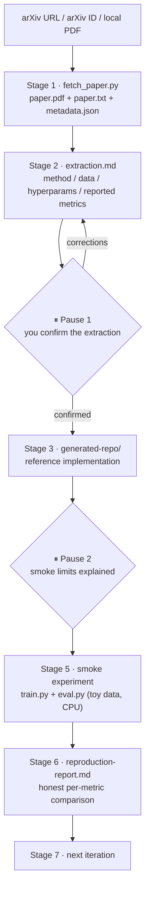

<div align="center">

# paper-to-code

**Paper → confirmed extraction → runnable reference repo → honest smoke experiment → metric comparison report**

[](https://www.python.org/)
[](SKILL.md)
[](https://github.com/22WELTYANG/paper-to-code/pulls)
[](#roadmap)
[](#license)

**English** | [简体中文](#简体中文)


</div>

---

## Why this exists

Reproducing papers is painful:

- Methods are scattered across formulas, pseudocode, and prose.
- Many papers ship no official code.
- Hyperparameters are often missing.
- Dataset and preprocessing descriptions are incomplete.
- AI agents routinely oversell partial runs as "matching the paper's SOTA".

`paper-to-code` lowers the friction of the *first step* of reproduction
while staying honest about what has and has not been verified.

## How it works



The two pauses are the trust mechanism: no code is generated before you
confirm `extraction.md`, and the smoke run never pretends to be a full
reproduction.

## What it does

- Fetches a paper from arXiv (URL or ID) or reads a local PDF.
- Extracts text page by page (`paper.txt`, with explicit warnings).
- Produces `extraction.md`: method, data, hyperparameters, and reported
  metrics — every missing piece marked `ASSUMED` or `UNKNOWN`.
- **Waits for your confirmation of `extraction.md` before writing any code.**
- Generates a standard reference-implementation repository.
- Runs a smoke experiment (toy data, few steps) proving the pipeline runs
  end to end.
- Produces `reproduction-report.md` comparing paper-reported metrics with
  smoke results, using per-metric status labels.

## What it does not do

- It does **not** claim to reproduce paper results or SOTA — a smoke
  experiment is not a full reproduction.
- It does **not** run full-scale training.
- It does **not** download full benchmark datasets by default.
- It does **not** pretend PDF parsing recovers formulas and tables reliably.
- It does **not** support non-arXiv URLs (download the PDF manually instead).

## Install

```bash
git clone https://github.com/22WELTYANG/paper-to-code.git
cd paper-to-code
bash install.sh
```

Windows (without bash):

```powershell
python -m venv .venv; .venv\Scripts\activate; pip install -r requirements.txt
```

## Quickstart

```bash
python scripts/fetch_paper.py 1706.03762 --out runs/transformer
```

Then open this project with your coding agent — Claude Code, Codex, or
Cursor — and say **"reproduce this paper"**. The agent follows
[SKILL.md](SKILL.md).

## Example outputs

`extraction.md` hyperparameter rows:

```markdown
| learning rate | custom schedule | §5.3, p.7 | REPORTED | warmup_steps=4000 |
| random seed   | 42              | —         | ASSUMED  | ASSUMED: value=42, reason=not stated in paper |
```

`reproduction-report.md` comparison rows:

```markdown
| Metric | Paper Reported | Smoke Result | Status | Notes |
|---|---:|---:|---|---|
| BLEU (EN-DE) | 28.4 | 1.2 | [GAP / 需要完整算力] | toy subset, 50 steps |
```

See [examples/walkthrough.md](examples/walkthrough.md) for the full flow.

## Trust and honesty policy

- A smoke experiment is **not** a full reproduction and is never described
  as one.
- Every hyperparameter the paper does not report is marked `ASSUMED` with a
  reason.
- Claiming SOTA reproduction is prohibited.
- Code generation only happens after the user confirms `extraction.md`.
- Metrics not verifiable in a smoke run are labelled `[GAP / 需要完整算力]`
  or `[NOT TESTED]`.

## Roadmap

- LaTeX source parsing (far better than PDF text for formulas)
- Formula and table extraction
- Dataset adapters and a benchmark harness
- Official-repo comparison mode
- Docker environment
- GitHub Action smoke test
- Model cards and reproducibility badges

---

# 简体中文

**论文 → 确认抽取 → 可运行参考实现 → 诚实的 smoke 实验 → 指标对照报告**

## 为什么做这个项目

复现论文很痛苦：方法散落在公式、伪代码和自然语言里；很多论文没有官方代码；
超参数经常缺失；数据集和预处理描述不完整；AI agent 还经常把部分复现夸大成
"已达论文 SOTA"。

`paper-to-code` 的定位不是"一键复现 SOTA"，而是降低复现**第一步**的摩擦，
同时对"哪些已验证、哪些没有"保持诚实。

## 它做什么

- 从 arXiv（URL 或 ID）抓取论文，或读取本地 PDF。
- 按页提取文本（`paper.txt`，附带明确的提取警告）。
- 生成 `extraction.md`：方法、数据、超参数、论文报告指标——所有缺失信息
  标注 `ASSUMED` 或 `UNKNOWN`。
- **在你确认 `extraction.md` 之前，不写任何代码。**
- 生成标准结构的参考实现仓库。
- 运行 smoke 实验（toy 数据、少量步数），证明代码端到端可运行。
- 生成 `reproduction-report.md`，逐指标对照论文报告值与 smoke 结果。

## 它不做什么

- **不**宣称复现了论文结果或 SOTA——smoke 实验不等于完整复现。
- **不**进行完整规模训练。
- **不**默认下载完整 benchmark 数据集。
- **不**假装 PDF 解析能可靠还原公式和表格。
- **不**支持非 arXiv 的 URL（请手动下载 PDF 后传本地路径）。

## 安装与快速开始

```bash
git clone https://github.com/22WELTYANG/paper-to-code.git
cd paper-to-code
bash install.sh
python scripts/fetch_paper.py 1706.03762 --out runs/transformer
```

然后用你的 coding agent（Claude Code / Codex / Cursor）打开本项目，说
**"复现这篇论文"**，agent 会按照 [SKILL.md](SKILL.md) 的 8 阶段流程执行。

## 工作流

1. **抓取解析** — `scripts/fetch_paper.py` 输出 `paper.pdf` / `paper.txt` / `metadata.json`
2. **方法抽取** — agent 按模板生成 `extraction.md`
3. **⏸ 停顿 1** — 你确认或修正抽取结果，确认前不写代码
4. **生成仓库** — 按 `references/repo-scaffold.md` 的契约生成
5. **⏸ 停顿 2** — agent 说明 smoke 实验的局限
6. **smoke 实验** — `python train.py --config config.yaml`（toy 数据）
7. **对照报告** — `reproduction-report.md`，逐指标诚实标注状态
8. **迭代建议** — 只放大你真正关心的部分

## 诚实政策

smoke 实验不等于完整复现；缺失超参数必须标注 `ASSUMED` 并附原因；禁止宣称
已复现 SOTA；生成代码前必须等待用户确认 `extraction.md`；smoke 无法验证的
指标标注 `[GAP / 需要完整算力]` 或 `[NOT TESTED]`。

---

## Star History

[](https://star-history.com/#22WELTYANG/paper-to-code&Date)

## License

License: TBD (placeholder).
